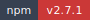
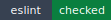

<!-- markdownlint-disable MD013 MD033 -->
<!-- This file is generated by Paradox. Do not edit manually. -->

# ZORA

        

Opinionated React Native and React Native Web UI kit built on @ankhorage/surface.

## Usage

### Minimal ZORA app root.

Use `ZoraProvider` once at the application root, place `AppShell` inside it,
and use `AppBar` as the default header slot for a simple app frame.

Source: `examples/basic-app/App.tsx`

```tsx
import {
  AppBar,
  AppShell,
  Screen,
  ScreenSection,
  Text,
  ZoraProvider,
  type ZoraTheme,
} from '@ankhorage/zora';

const basicTheme: ZoraTheme = {
  id: 'basic-app',
  name: 'Basic app',
  appCategory: 'developer_tools',
  primaryColor: '#0b6e99',
  harmony: 'analogous',
};

export default function BasicApp() {
  return (
    <ZoraProvider initialMode="light" theme={basicTheme}>
      <AppShell header={<AppBar title="Dashboard" subtitle="Welcome to ZORA" />}>
        <Screen>
          <ScreenSection>
            <Text variant="lead">Build your app content inside the shell.</Text>
          </ScreenSection>
        </Screen>
      </AppShell>
    </ZoraProvider>
  );
}
```

## Generated documentation

- [Interactive documentation app](././paradox/index.html)
- [Public API reference](././paradox/exports.md)
- [Component registry](././paradox/components.md)
- [Architecture overview](././paradox/diagrams/architecture-overview.mmd)
- [Module relationships](././paradox/diagrams/module-relationships.mmd)
- [Export graph](././paradox/diagrams/export-graph.mmd)
- [createZoraThemeConfig sequence](././paradox/diagrams/sequences/create-zora-theme-config.mmd)
- [resolveAvatarInitials sequence](././paradox/diagrams/sequences/resolve-avatar-initials.mmd)
- [SelectableItem sequence](././paradox/diagrams/sequences/selectable-item.mmd)
- [SelectionProvider sequence](././paradox/diagrams/sequences/selection-provider.mmd)
- [useFormController sequence](././paradox/diagrams/sequences/use-form-controller.mmd)
- [useZoraTheme sequence](././paradox/diagrams/sequences/use-zora-theme.mmd)
- [validateField sequence](././paradox/diagrams/sequences/validate-field.mmd)
- [validateFields sequence](././paradox/diagrams/sequences/validate-fields.mmd)
- [ZoraProvider sequence](././paradox/diagrams/sequences/zora-provider.mmd)
